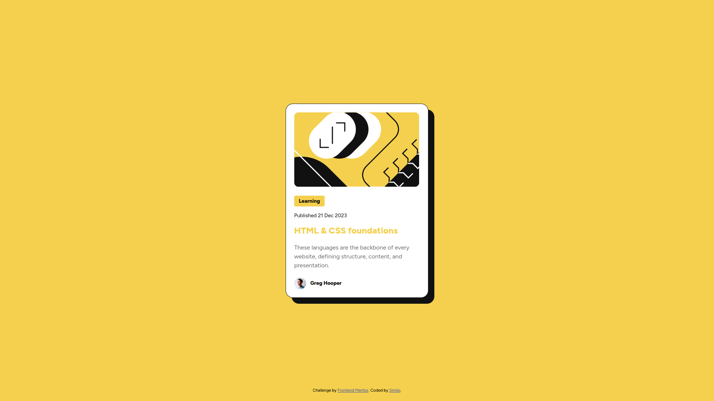

# Frontend Mentor - Blog preview card solution

This is a solution to the [Blog preview card challenge on Frontend Mentor](https://www.frontendmentor.io/challenges/blog-preview-card-ckPaj01IcS). Frontend Mentor challenges help you improve your coding skills by building realistic projects. 

## Table of contents

- [Overview](#overview)
  - [The challenge](#the-challenge)
  - [Screenshot](#screenshot)
  - [Links](#links)
- [My process](#my-process)
  - [Built with](#built-with)
  - [What I learned](#what-i-learned)
  - [Continued development](#continued-development)
  - [Useful resources](#useful-resources)
- [Author](#author)
- [Acknowledgments](#acknowledgments)

**Note: Delete this note and update the table of contents based on what sections you keep.**

## Overview

### The challenge

Users should be able to:

- See hover and focus states for all interactive elements on the page

### Screenshot

### Links

- Live Site URL: https://chief-99.github.io/blog-preview-card/

## My process

### Built with

- Semantic HTML5 markup
- CSS custom properties
- Flexbox

### What I learned

Doing this project I learnt quite a lot about how to do things in a more concise manner. I am hust starting out with HTML and CSS and I definitely still have a lot to learn. I also learnt quite a bit about animations even though I only used one and I am quite proud of it even though it is something simple. It is nice to see progress in your work.

### Continued development

As mentioned previously, I want to improve my mental CSS model. So just the way I think about it as a whole so that I can use it more efficiently and I think the projects offered by this course will help a lot as they will give me quite a bit of practice. I also want to keep on learning more HTML and CSS best practices as I have noticed there are quite a lot. 

### Useful resources

- https://www.joshwcomeau.com/animation/css-transitions/#the-fundamentals-1 - This article helped me a lot when it came to understanding animations and I will definitely be referring back to it in the future.
- https://developer.mozilla.org/en-US/docs/Web/CSS/CSS_fonts/Variable_fonts_guide - This was recommended to me by someone on the discord server and it helped me understand exactly what variable fonts were and how to use them. 

## Author

- Frontend Mentor - [@Chief-99](https://www.frontendmentor.io/profile/Chief-99)

## Acknowledgments

I would like to thank Grace Snow (@gracesnow) for helping me out quite a lot with this. She gave me a lot of really amazing feedback that really helped me improve my project so if you're reading this Grace, thank you once again!!
